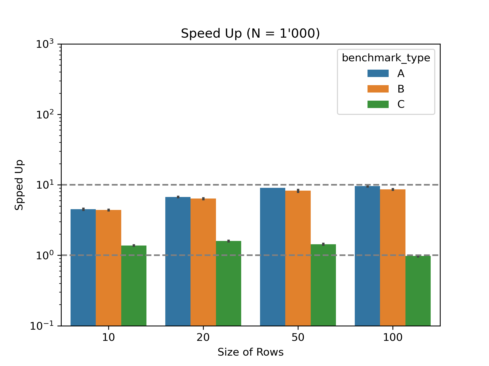
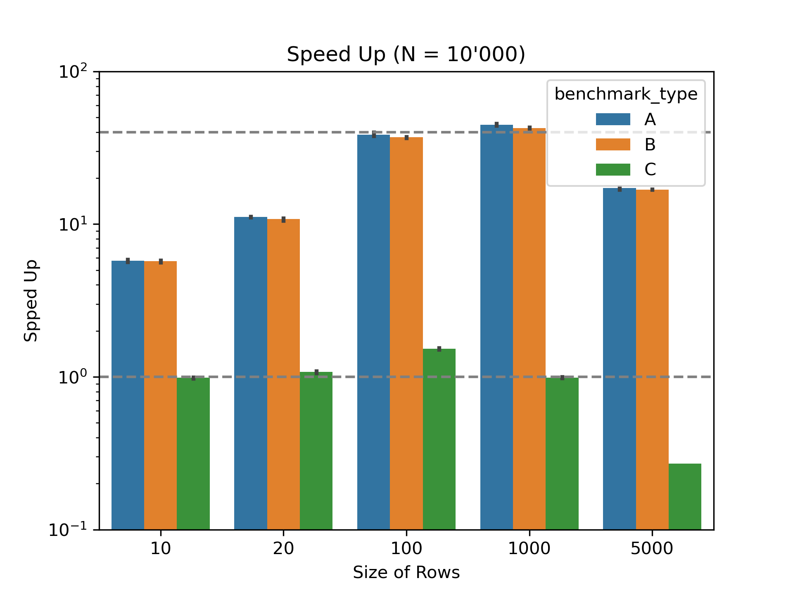
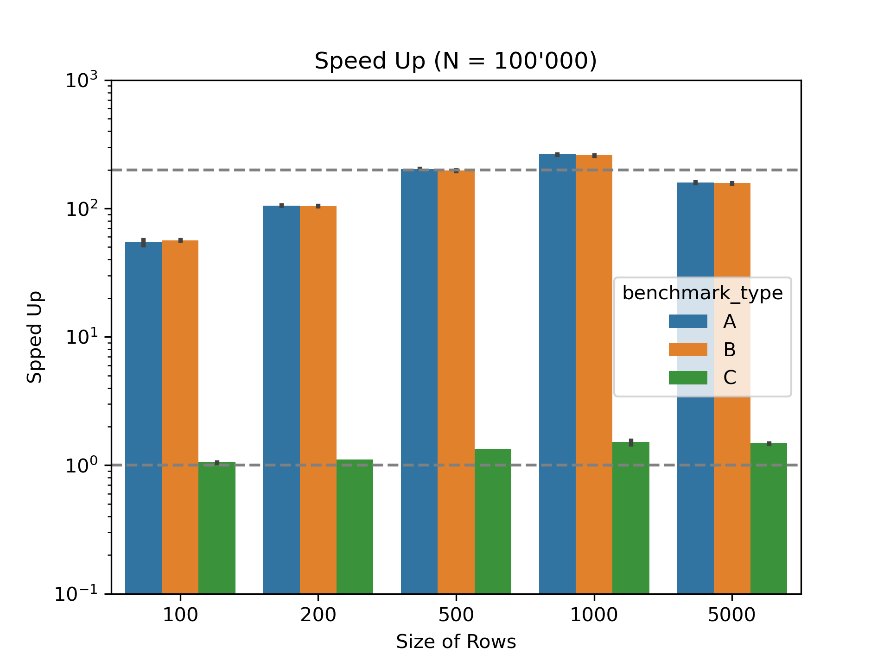

# `bucket` - Efficient Lazy Update for Cumulative Sums and Upper Bound Indices.

A header-only C++ library that efficiently uses the **lazy update protocol**  for cumulative sums of a 1D container such as `std::vector<double>`.

It supports arithmetic operations on primary data types `(double, float, int, uint8_t, ...)` but does not handle custom-defined types with self defined operations. 


## Cumulative Sums (a.k.a Prefix Sums):
---
The cumulative sum of a sequence `a_i` is a sequence defined as 

` sₖ = a₀ + a₁ + ... + aₖ`


Updating or calculating from scratch the cumulative sum is an `O(N)` operation.


# Problem
---
Many algorithms (such as the Gillespie), at their core, have a main loop where both the underlying sequence and its cumulative sum are updated on every iteration based on a random number. If `N>100` this update is the bottleneck in the execution of the program. If `N>1e6`  we might start thinking for letting a GPU handle the cumulative sum.

In this project, however, we tackle another (not-so-rare) scenario found in many real-world applications in which the updates of the underlying data happen at a very small local range. For example at one iteration the underlying data present a change from element 40 to 50. In such a scenario we can use the so called lazy update protocol.


# Lazy update protocol explained:
---
Instead of storing the whole cumulative sum we can imagine as if the vector is in a matrix form  and for each row we calculate the sum of that row. Moreover, we keep a **second-level cumulative sum** over those row sums. Pictographically :

**Lazy Update Breakdown**

| Raw Data Block (Row)                                  | → | Row Sum         |
|--------------------------------------------------------|----|------------------|
| `a₀, a₁, ..., a₍COLS₋₁₎`                               | →  | `sum₀`           |
| `a_COLS, ..., a_(2×COLS-1)`                            | →  | `sum₁`           |
| `⋮`                                                    |    | `⋮`              |
| `a_((ROWS-1)×COLS), ..., a_(ROWS×COLS - 1)`            | →  | `sum_{ROWS-1}`   |

**Cumulative sum of row sums:**

```
cumₖ = sum₀ + sum₁ + ... + sumₖ₋₁
```

Where `sum_row` is the sum of that particular row.


### Constraints:
- You can choose the number of rows and columns for optimal efficiency in your specific case  [see Total Cost Comparison](#-total-cost-comparison).
- The only requirement is that `ROWS x COLS >= size of the data`.


## Update the Data
---
If an element of a particular row is updated:
1) We need to calculate the sum of a ROW `O(COLS)`
2) Adjust the cumulative sum of that row onward.

Extra note: The last part can further be optimised because  in practice we can simply add the difference of the updated sum element to the rest of the elements in the cumulative sum, thus avoiding multiple reads of the sum vector. Still, the operation of the cumulative sum is linear `O(ROWS)`. However, it is linear in terms of the number of ROWS, which for the majority of the relevant applications ROWS should be close to `sqrt(N)`.

## Find upper Bound
---
This operation is crucial for sampling from distributions. Unfortunately, for this operation, we get a penalty for using this data structure. Initially, the upper bound in a sorted vector such as the full cumulative sum is `O(logN)`. Now, we have to:
1) Perform a binary search over the second layer of cumulative sums.
2) A linear scan over the selected row.

The total cost is`O(log(ROWS)+COLS) ~ O(COLS)` vs the traditional `O(logN)`.


## Total Cost Comparison
---
| Operation            | Standard Vector              | Lazy Bucket Version                          |
|----------------------|------------------------------|----------------------------------------------|
| Update full cumsum   | `O(N)`                       | `O(ROWS + COLS)`                             |
| Find upper bound     | `O(log N) `                  | `O(log (ROWS) + COLS)`                       |
| Total per iteration  | Slow if large `N`            | Fast if changes are local                    |


## Choose the correct values for ROWS, COLS
---
From the theoretical expressions shown in the previous section we get the best performace when


`COLS \approx ROWS/3 ... ROWS/2`

In some cases it also worths to use some padding on the underlying vector (add some ghost zeros at the end) to ensure that that the chosen number of columns and rows lead to a better efficiency.


# Installation
---
Since it's header-only, you can simply copy bucket.hpp into your project.

```Cmake```
You can also clone the repo and use on the cmake of your project. 
```
#It is assumed that external libraries are 
#placed in an external folder. Adjustable.

add_subdirectory(<external/bucket>) 
target_link_libraries(your_target PRIVATE bucket)

```

Optional install support is available, simply add the following command to your cmake:
```
set_option(BUCKET_INSTALL ON)
```


# Usage
---
If you have copied the file manually, then add to your script
```
#include "bucket.h"
```

If you used cmake then the inclusion is
```
#include <bucket/bucket.hpp>
```

# BENCHMARKS

To illustrate the effectivenes of this datastructure we performed a comparison between this datastructure and a sequential implementation. We defined 3 types of benhcmark to make our analysis more robust and present the true potential of this library, as well as its pitfalls. 

For each type of benchmark we used three different problem sizes (i.e size of the main vector): N = 1K, 10K ,100K elements. We did not move above that number because we believe that for more than 100K elements a GPU implementation of exscan is superior.
In addition we iterate over different ROW sizes to showcase the effect on the performance. As you one can see from the figure, it is clear that indeed the best performance is achieved when ROWS ~ sqrt(N).

## Types of Benchmarks

We performed 3 types of benchmark:

### One single change
In this type of benhcmark, we randomly alter one element of the main vector followed by a row update a refresh of the cummulative sum and a random search for upper bound.

### Consecutive changes
In this type of benchmark we chnage 4 consecutive elements of the main vector followed again by row updates a refresh and an upper bound search. The idea is to showcase that this data structure and the accompany algorithms perform equally fast as in the first case if the changes are local.

### Worst case
We alter one element at every row and force a full update. This tries to illustrates that in the worst case scenario this datastructure will perform reasonably well compared to a sequential vector and exscan


## Speedup Benchmarks

Here are the comparison of bucket vs sequential for different problem sizes as indicated by the titles:






### Conclusions
The results of the benchmark show an immediate imporvement on almost all benhchmarks and problem sizes with the exception of the worst case scenario where the whole datastructure has to compute the full exscan. This is expected as a result and of course it is not the use case we had in mind. However, if the application contain such worst case updates which are not systematic then the extra cost of this library might be compensated by the spped up it can offer in more local updates.

It is also clear that the better results we achieved for very local changes and updates as well as for large problem sizes. One can see that for a size of 100K the speed up can be a bit more than 200x compared to the naive implementation.

The type A benhcmark presents no significant difference from type B benchmark indicating that local updates that are in close rows do not add significant overhead during the calculations.


# Platform Support / Compiler
---
It has been tested only under: 
- Ubuntu [22.04, 24.04]
- GCC and Clang with C++ 20


